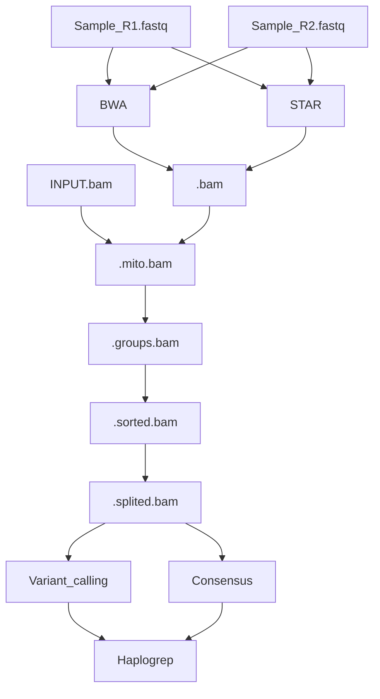

# MITOSEQ
A pipeline dedicated to mitochondrial haplogroup finding from RNA sequencing data.

_________
## Installation/Configuration
- You need to clone this project to your desired directory with ```git clone HTTPS/SSH``` but you need to configure your SSH keys to perform the SSH copy

- In order to make this pipeline work you need to have conda installed and the environnement configured:

    - To download Miniconda : https://docs.conda.io/en/latest/miniconda.html

    - To install Miniconda : https://conda.io/projects/conda/en/latest/user-guide/install/index.html

    - To setup the environnement: ```conda env update --file src/environment/env.yml --name MitoSeq ; conda activate MitoSeq```

- Once this done all target reads should be moved into    {PATH_TO_MITOSEQ}/data/input/samples/

    - If you use .FASTQ as input make sure that paired RNASeq input sequences are called according to ```{sample_name/info}_R(1|2).fastq```

    - You can add a .BAM or .BAM.GZ

- Folders reference/, mitochondria/ and gtf/ (Cf Example) in data/input/ exist in order to let you put the reference/annotation of your choice, if you don't want to use the default ones that will be downloaded automatically if the folders are empty. If you decide to use your own reference/annotation, make sure that none of these folders contain more than 1 file, otherwise the pipeline will return an error. 


## Pipeline execution
- Once the previous steps are done you can perform the run by executing the following command
```$ python mitoseq.py```

- This should take time based on the number of samples

What is done to each sample:

(Genome reference, Mitochondrial reference, GTF and their indexes are not showed for pipeline visibility, they're used in many places)

## Examples
### For complete information you can get the arguments manual by:
```$ python mythoseq.py -h```

Or feel free to check the documentation file in the root folder of the project.

### Here are the main arguments :

- By default, the fastq data alignement will be performed by BWA, if you wish this step to be performed by STAR please specify it:

```$ python mitoseq.py --star```  or  ```$ python mitoseq.py -s```

(STAR mapping takes a lot of RAM, ~50Gb for one sequence)

- You can decide to use the consensus sequence after the mapping:

```$ python mitoseq.py --consensus```  or  ```$ python mitoseq.py -e```

This should run faster, but will lose variation data, as the most common base would be chosen and not all of them.

- If your machine is limited in hardware you can specify hardware options:

```$ python mitoseq.py --core 2 --thread 2```  or  ```$ python mitoseq.py -c 2 -t 2```

which will run the pipeline on 2 cores using 2 threads.

- You can choose to keep all transitional files by using the following command:

```$ python mitoseq.py --keep```  or  ```$ python mitoseq.py -k```

(Not recomended as far as every run generates ~50Gb of data for the whole genome)

Be sure to specify the parameter ```-n CHRMNAME``` with the reference genome mitochondrial contig name in case it's different from the mitochondrial reference contig name in order to keep compatibility.

## Results
- By the end you will obtain data/output/haplogroups.txt in which all sample's haplogroups are merged along with the Haplogrep's quality score for each sample.
