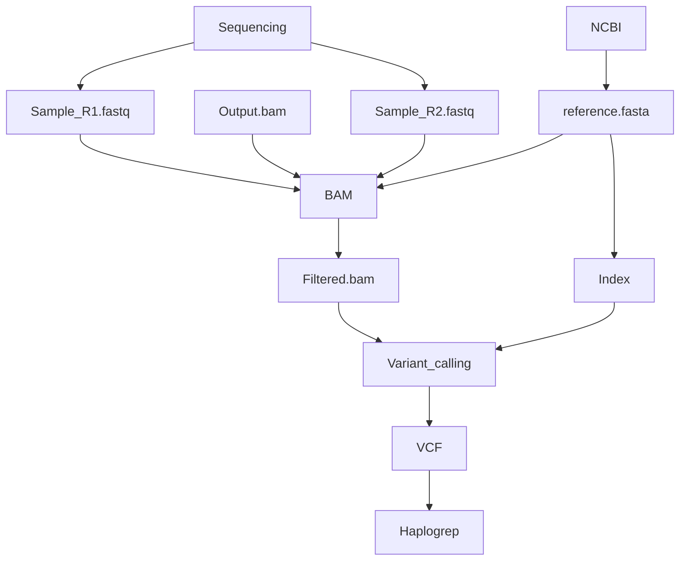

[](https://forthebadge.com)

# MITOSEQ
A pipeline dedicated to mitochondrial genome analysis from RNA sequencing data.

_________
## Installation/Configuration
- You need to clone this project to your desired directory with ```git clone```

- In order to make this pipeline work you need to have conda installed and the environnement configured:

    1) To download Miniconda : https://docs.conda.io/en/latest/miniconda.html

    2) To install Miniconda : https://conda.io/projects/conda/en/latest/user-guide/install/index.html

    3) To setup the environnement: ```conda env update --file src/environment/env.yml --name MitoSeq ; conda activate MitoSeq```

- Once this done all target reads should be moved into    path/to/mitoseq/1_Input/2_samples/

    1) If you use FASTQ as output make sure that paired RNASeq output sequences are called according to ```{sample_name/info}_R(1|2).fastq```

- Execute the mitoseq.py:
```$ python mitoseq.py```

- This should take time based on the number of samples


What is done to each sample:

