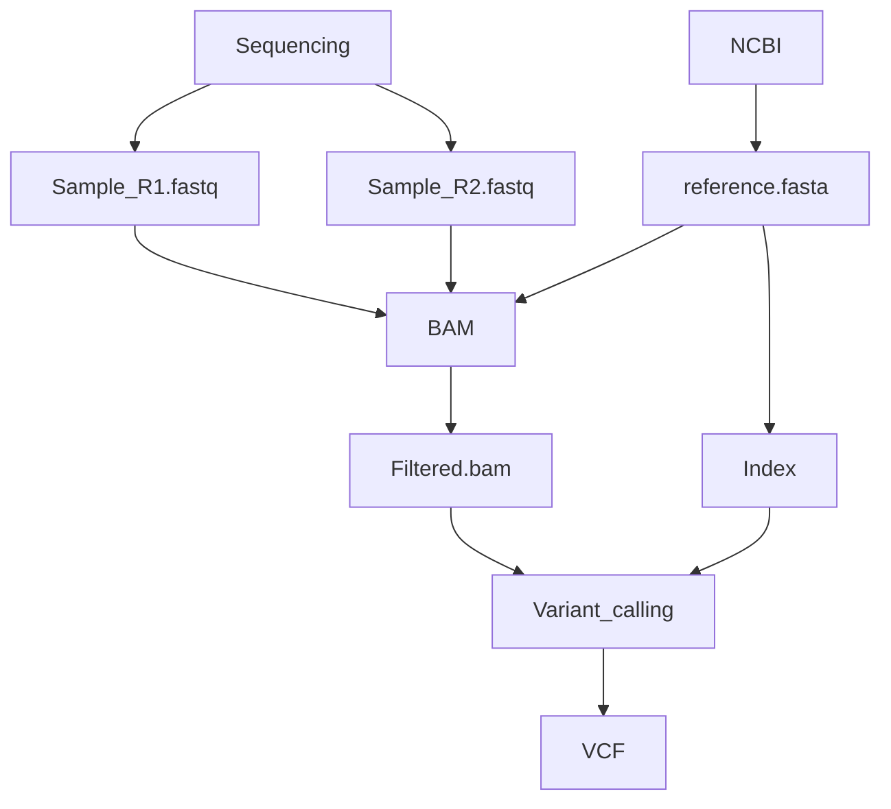

# mitoseq
A pipeline dedicated to mitochondrial genome analysis from RNA sequencing data.

# Variant Calling Step
# (currently the alignement is performed with bwa)
- Make sure that your conda environment has all tools installed with correct versions (cf. envs/config.yaml)

- You need to clone this project to your desired directory with ```git clone```

- In order to make this pipeline work setup.sh and mitoseq.py need to have rights to execute:
```$ chmod +x setup.sh mitoseq.py```

- All directory creation is configured in setup.sh:
```$ ./setup.sh```

- Once this done all target reads should be moved into    path/to/mitoseq/1_Input/2_samples/
    1) If the output files are compressed :
    ```$ gzip -d 1_Input/2_samples/*.gz```
    1) The paired RNASeq output sequences must be called according to ```{sample_name/info}_R(1|2).fastq```

- Execute the mitoseq.py:
```$ python mitoseq.py```

- This should take time based on the number of samples


What is done to each sample:
