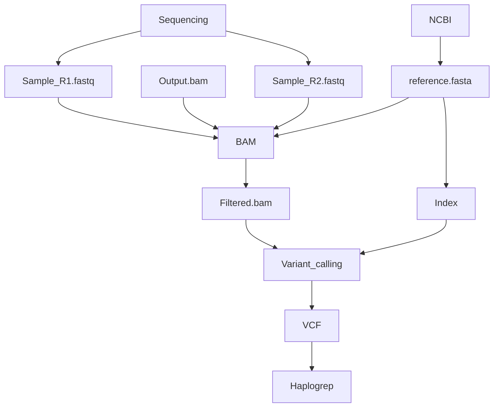

[](https://forthebadge.com)

# MITOSEQ
A pipeline dedicated to mitochondrial genome analysis from RNA sequencing data.

_________
## Installation/Configuration
- You need to clone this project to your desired directory with ```git clone```

- In order to make this pipeline work you need to have conda installed and the environnement configured:

    1) To download Miniconda : https://docs.conda.io/en/latest/miniconda.html

    2) To install Miniconda : https://conda.io/projects/conda/en/latest/user-guide/install/index.html

    3) To setup the environnement: ```conda env update --file src/environment/env.yml --name MitoSeq ; conda activate MitoSeq```

- Once this done all target reads should be moved into    path/to/mitoseq/data/input/samples/

    1) If you use FASTQ as output make sure that paired RNASeq output sequences are called according to ```{sample_name/info}_R(1|2).fastq```.

    2) If you use BAM as output the prefix of each file will be used as a sample ID, feel free to rename it as you wish.

    3) If both extention types are used for the same analyze:
        - For the same sample, the .bam will be used as it takes less time;
        - For different samples, make sure you used the --two-ext (-te) argument while executing the ```mitoseq.py``` (see below).
    
    OR

    3) In current version there is no support for inputs in both FASTQ and BAM at the same time, make sure that only one type of input is used per run. 

## Pipeline execution
- Once the previous steps are done you can perform the run by running the following command
```$ python mitoseq.py```

- This should take time based on the number of samples

What is done to each sample:


## Examples
### For complete information you can get the arguments manual by:
```$ python mythoseq.py -h```

Or feel free to check the documentation file in the root folder of the project.

- By default, the fastq data alignement will be performed by BWA, if you wish this step to be performed by STAR please specify it:

```$ python mitoseq.py --star``` or ```$ python mitoseq.py -a```

In this case the script need

- If your machine is limited in hardware you can specify hardware options:

```$ python mitoseq.py --core 2 --thread 2```  or  ```$ puthon mitoseq.py -c 2 -t 2```

which will run the pipeline on 2 cores using 2 threads.

- You can choose to keep all transitional files by using the following command:

```$ python mitoseq.py --keep``` or ```$ puthon mitoseq.py -k```

(Not recomended as far as every run generates ~50Gb of data for the whole genome)


